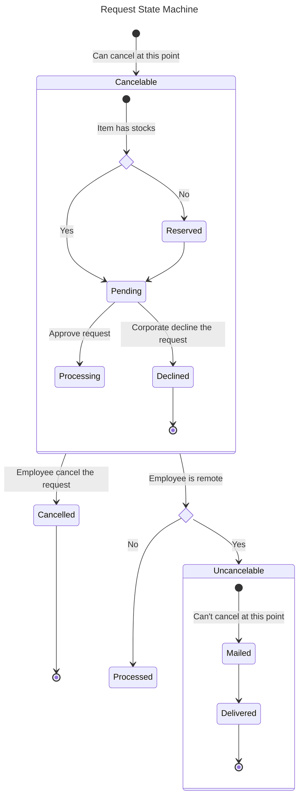

```mermaid
---
title: Request State Machine
---
stateDiagram-v2
	state is_remote <<choice>>
	[*] --> Cancelable: Can cancel at this point
	Cancelable --> Cancelled: Employee cancel the request
	Cancelled --> [*]
	state Cancelable {
		state has_stocks <<choice>>
		[*] --> has_stocks: Item has stocks
		has_stocks --> Reserved: No
		has_stocks --> Pending: Yes
		Reserved --> Pending
		Pending --> Processing: Approve request
		Pending --> Declined: Corporate decline the request
		Declined --> [*]
	}
	Cancelable --> is_remote: Employee is remote
	is_remote --> Uncancelable: Yes
	is_remote --> Processed: No
	state Uncancelable {
		[*] --> Mailed: Can't cancel at this point
		Mailed --> Delivered
		Delivered --> [*]
	}
```