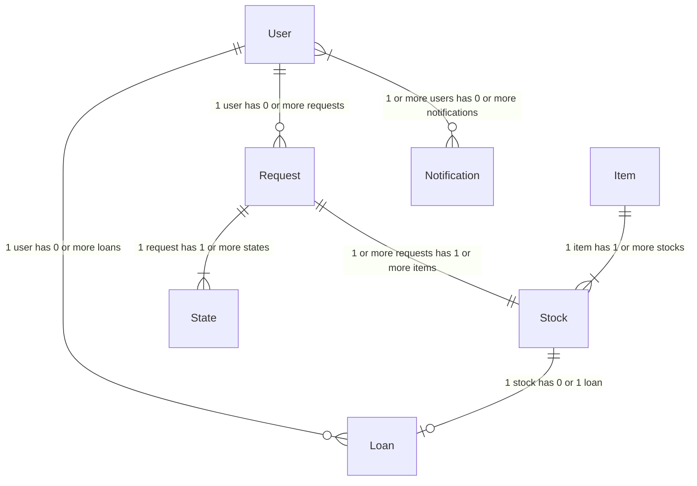
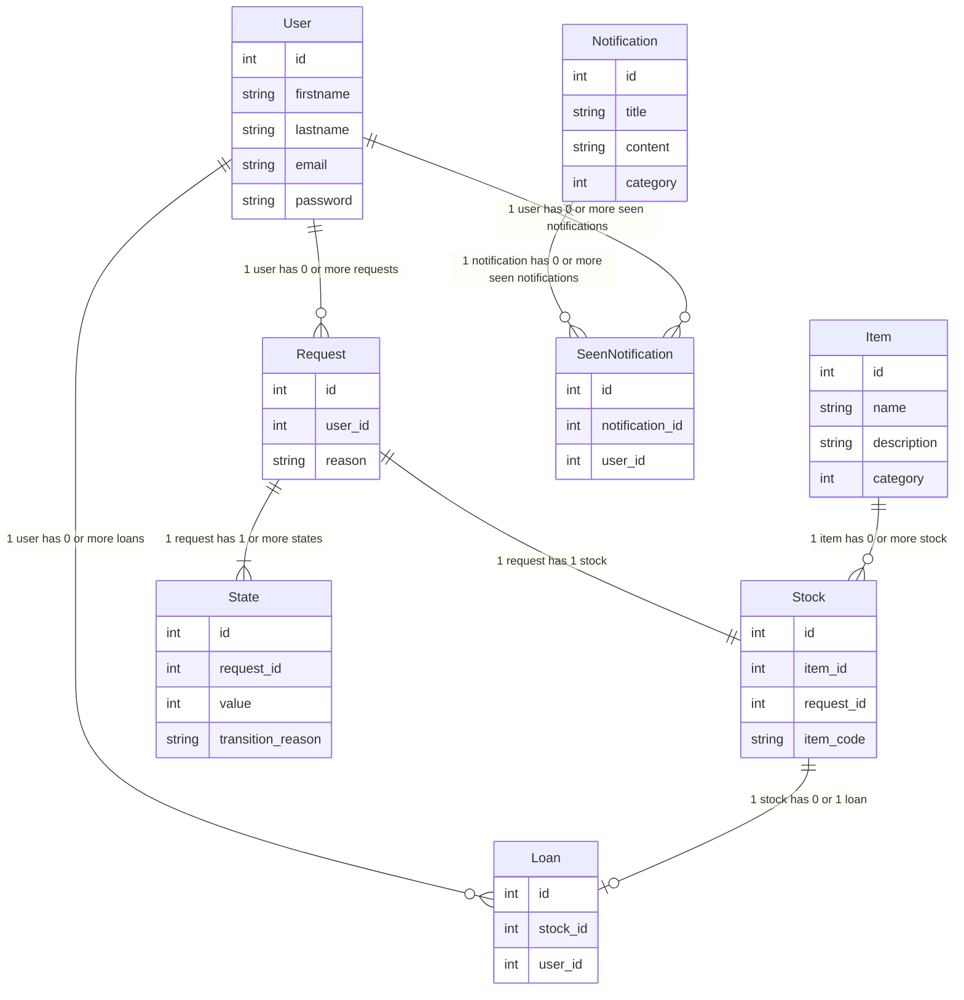
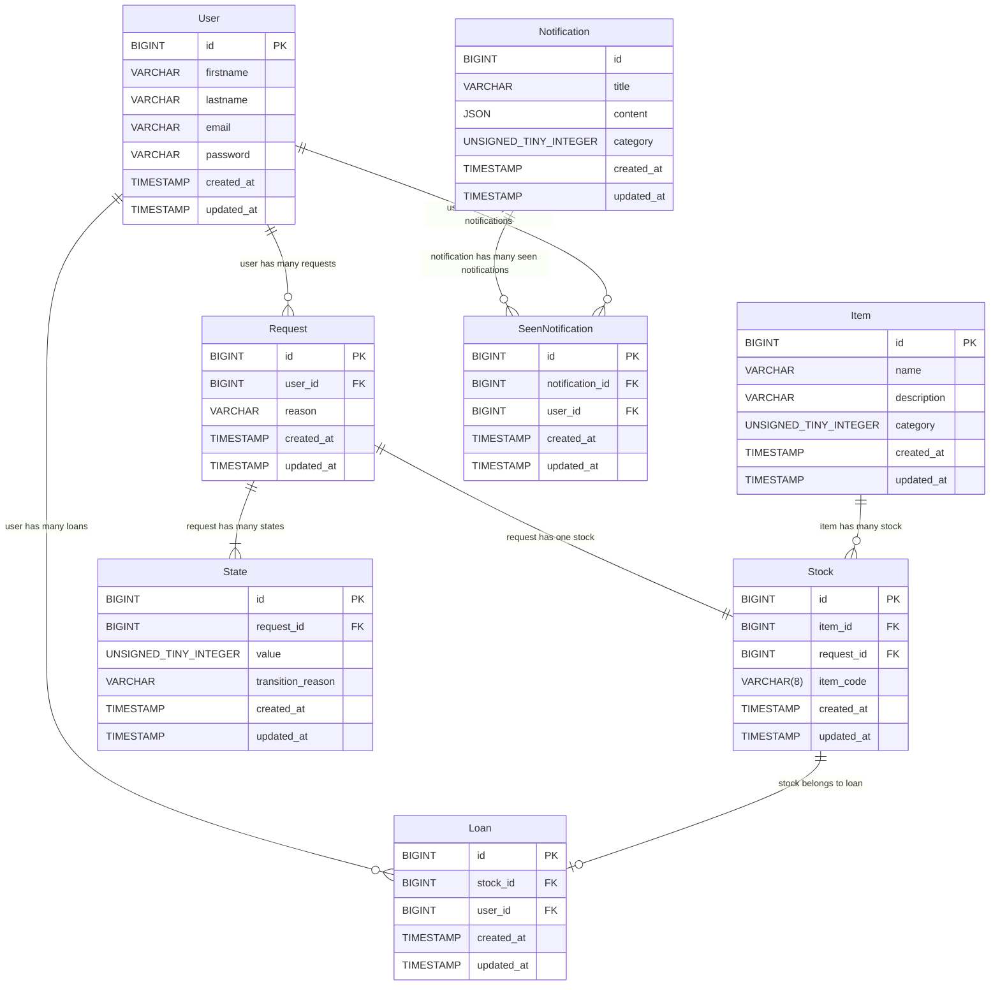

# What Is This Document

A document that summarizes the entities that appear in the application.

# Application Entities

- [User]() - Users who can operate the application
- [Item](./Item/overview.md) - Items owned by the organization
	- [Stock]() - Items stock
	- [Loan]() - Loeaned Items
- [Request]() - Request for items
	- [RequestedItem]() - Items requested per one request
	- [State]() - Request state history
- [Notification]() - Notices to be displayed to users 
	- [SeenNotification]() - Notice seen by users.

# ER Diagram

## Conceptual Model

## Logic Model

## Physical Model

# Database Definition

## users

| column | type | nullable | default |
| ------ | ---- | -------- | ------- |
| id | UNSIGNED BIGINT | | |
| firstname | VARCHAR | NULLABLE | |
| lastname | VARCHAR | NULLABLE | |
| email | VARCHAR | | |
| password | VARCHAR | NULLABLE | |
| created_at | TIMESTAMP | | |
| updated_at | TIMESTAMP | | |

## items

| column | type | nullable | default |
| ------ | ---- | -------- | ------- |
| id | UNSIGNED BIGINT | | |
| name | VARCHAR | | |
| description | VARCHAR | | |
| category | UNSIGNED TINY INTEGER | | |
| created_at | TIMESTAMP | | |
| updated_at | TIMESTAMP | | |